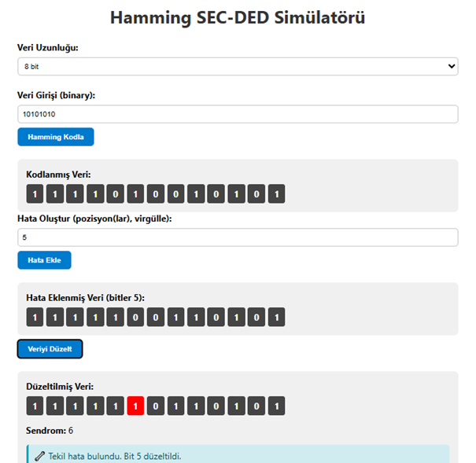
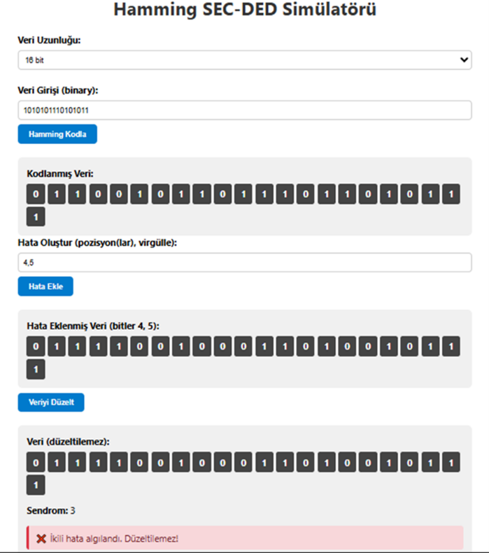
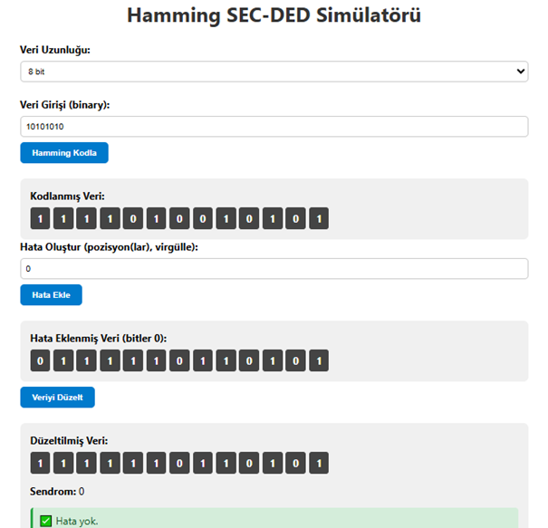

# 🧪 Hamming SEC-DED Simülatörü

Bu proje, **Hamming SEC-DED (Single Error Correction, Double Error Detection)** algoritmasını tarayıcı üzerinden simüle etmektedir. Kullanıcı, binary veri girişi yaparak Hamming kodlamasını görebilir, hataları manuel olarak enjekte edebilir ve bu hataların nasıl tespit edilip düzeltildiğini gözlemleyebilir.

---

## 🚀 Özellikler

- ✅ 8, 16 veya 32 bit veri desteği
- ✅ Hamming kodlama (r parity bit + 1 genel parity)
- ✅ Manuel hata enjekte etme
- ✅ Tekli hata düzeltme, çift hata tespiti
- ✅ Görsel ve interaktif kullanıcı arayüzü

---

## 🧭 Nasıl Kullanılır?

1. `index.html` dosyasını tarayıcıda açın.
2. Veri uzunluğunu (bit sayısı) seçin ve binary veri girin (örneğin: `11010101`).
3. “Hamming Kodla” butonuna tıklayın.
4. Hata eklemek için bit pozisyonlarını girin (örn: `3,5`).
5. “Veriyi Düzelt” butonuna basın.
6. Simülatör, hatayı analiz ederek düzeltme yapar veya kullanıcıyı bilgilendirir.

---

## 📁 Dosya Yapısı

```

/
├── index.html          # Ana HTML arayüzü
├── script.js           # Hamming kodlama ve hata düzeltme mantığı
├── style.css           # İsteğe bağlı stil dosyası
├── README.md           # Bu doküman
└── resimler/             # Ekran görüntüleri
├── resim1.png
├── resim2.png
└── resim3.png

```

---

## 📸 Örnek Ekran Görüntüleri

### 🔢 1. Kodlama Sonrası Veri

Kullanıcıdan alınan binary veri Hamming SEC-DED algoritması ile kodlanmış hali:



---

### ❌ 2. Hatalı Veri (Çift Hata Enjekte Edilmiş)

Seçilen bit pozisyonlarına (örneğin 2 ve 5) manuel olarak hata eklenmiş hali:



---

### 🛠️ 3. Hata Düzeltme Sonucu

Sistem tarafından tekli hata tespit edilip düzeltilmiş veri:



---

## 🔧 Teknik Bilgiler

### Kullanılan Fonksiyonlar

- `encodeData()` → Veriyi Hamming koduna dönüştürür.
- `injectMultipleErrors()` → Belirli pozisyonlardaki bitleri ters çevirir (hata enjekte eder).
- `calculateSyndrome()` → Parity kontrolleriyle sendrom hesaplar.
- `correctData()` → Sendrom ve parity değerlerine göre hatayı analiz edip düzeltir veya bildirir.

### SEC-DED Nedir?

**SEC-DED**, Hamming kodunun geliştirilmiş bir versiyonudur:
- **SEC**: Single Error Correction – Tekli hataları düzeltir.
- **DED**: Double Error Detection – İkili hataları tespit eder (düzeltemez).

---

## ✅ Gereksinimler

Bu proje tamamen istemci taraflıdır ve çalışması için tek gereken şey modern bir web tarayıcısıdır. Ekstra bir kütüphane veya sunucu gerekmez.
